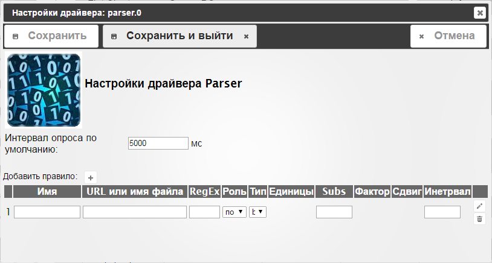
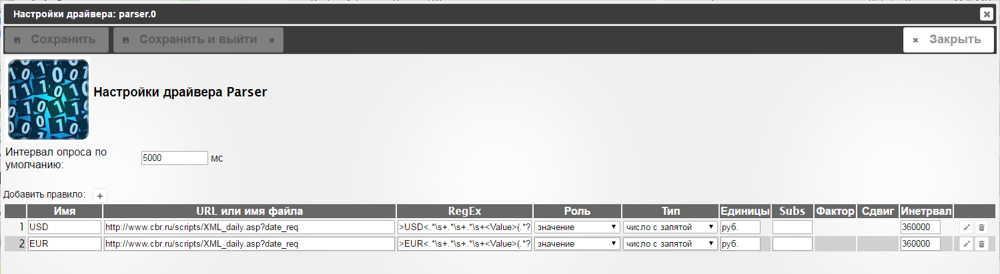
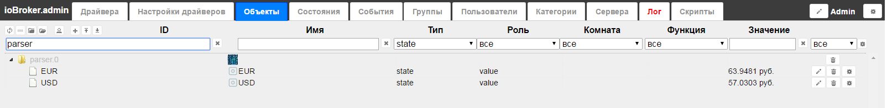

## Описание

Драйвер используется для парсинга(извлечения) данных из ссылок URL или файлов с помощью регулярных выражений.

### Параметры конфигурации

- *Интервал опроса по-умолчанию* Это значение будет использоваться, если интервал опроса для правила не указан. Интервал задается в миллисекундах и означает, как часто будут обновлятся данные из ссылки или файла.
- *Кнопка* '+' - Для добавления новой строки правил.
- *Имя* - это имя состояния(обьекта) не может содержать пробелы.
- *URL или имя файла* - это URL-ссылка, например https://darksky.net/forecast/55.7507,37.6175/si24/en, для погоды в Москве.
- *RegEx* - регулярное выражение, что бы извлечь данные из ссылки. Существует хороший сервис для тестирования регулярных выражений: regex101. Например. *Temp swip "> (-? \ D +) ˚ <* для парсинга данных температуры.
- *Роль* - одна из ролей:
    - свой - пользователь определяет собственное значение роли через админку на вкладке Объекты.
    - Температура - значение температуры
    - значение - значение представляет собой число (например, диммер)
    - окна - это значение положение окна(шторы)
    - Переключатель - значение - положение переключателя (true / false)
    - Индикатор - логический индикатор
- *Тип* - тип переменной. Один из булевых, число, строка или json.
- *Item* - номер найденного элемента, начиная с 0.
- *Единица* - единица значения. Например. ° С
- *Подстановочные значения* - Это значение будет использоваться, если файл или URL недоступен.
- *Фактор / сдвиг(смещение)* - вычисленное значение = извлеченное значение * коэффициент(Фактор) + смещение, чтобы немедленно внести изменения в значение. Используется только для чисел.
- *Интервал* - интервал опроса в мс. Если не установлено или 0, значит, будет использоваться интервал по умолчанию.

## Примеры настроек
| Имя               |      URL или имя файла                               |      RegEx            | Роль         | Тип     | Единицы | Инетрвал |
|-------------------|:-----------------------------------------------------|:----------------------|--------------|---------|---------|----------|
| temperatureMoscow | https://darksky.net/forecast/55.7507,37.6175/si24/en | temp swip">(-?\d+)˚<  | температура  | число   |   °C    | 180000   |
| forumRunning      | http://forum.iobroker.net/                           | Forum                 | индикатор    | boolean |         | 60000    |
| cloudRunning      | https://iobroker.net/                                | Privacy Notice        | индикатор    | boolean |         | 60000    |
| cpuTemperature    | /sys/devices/virtual/thermal/thermal_zone0/temp      | (.*)                  | температура  | число   |     °C  | 30000    |

### О регулярных выражениях

Регулярные выражения - это мощный инструмент для анализа и извлечения данных из строк.

Вы можете эффективно проверить, есть ли какой-либо текст в строке или извлечь какой-либо текст из строки в переменную.

Для булевых типов достаточно написать простой RegEx. Для числовых типов вы должны отметить число с помощью скобок - «()». Например. Для извлечения значения температуры 5 ° C вы должны использовать выражение «(\ d +)». \d - в данном случае означает любое число.

Подробнее о регулярных выражениях можно прочитать здесь: https://developer.mozilla.org/ru/docs/Web/JavaScript/Reference/Global_Objects/RegExp

### Примеры
- *.at* Соответствует любой трехсимвольной строке, заканчивающейся «at», включая «hat», «cat» и «bat».
- *[hc]at* Соответствует "hat" и "cat".
- *[^b]at* Соответствует всем строкам, сопоставляемым .at, за исключением «bat».
- *[^hc]at* Соответствует всем строкам, совпадающим с .at, отличным от «hat» и «cat».
- *^[hc]at* Соответствует «hat» и «cat», но только в начале строки или строки.
- *[hc]at$* Соответствует «hat» и «cat», но только в конце слова или строки.
- *\[.\]* Соответствует любому одиночному символу, окруженному «[» и «]», поскольку скобки экранированы, например: «[a]» и «[b]».
- *s.\** Соответствует s, за которым следуют ноль или более символов, например: «s» и «saw» и «seed».
- *[hc]+at* Соответствует «hat», «cat», «hhat», «chat», «hcat», «cchchat» и т.д., Но не «at».
- *[hc]?at* Соответствует «hat», «cat» и «at».
- *[hc]\*at* Соответствует «hat», «cat», «hhat», «chat», «hcat», «cchchat», «at» и т.д.
- *cat|dog* Соответствует «cat» или «dog».
- *(\d+)* - Получить число из строки
- *now (\w+)* later - Получить слово между «now» и «later»,

### Наиболее полезные выражения

- (-?\d+) Получить число отрицательное или положительное

###  Значения могут иметь код качества

0 - OK
0x82 - URL или файл не может быть прочитан.
0x44 - Число или строка не найдены по запрашиваемому URL или в файле.

### Пример получения курсов валют с сайта ЦБ
Вносим в окне настроек следующие параметры:

| Имя    |      URL или имя файла                            |      RegEx                                | Роль      | Тип              | Единицы | Инетрвал |
|--------|:--------------------------------------------------|:------------------------------------------|-----------|------------------|---------|----------|
| USD    | http://www.cbr.ru/scripts/XML_daily.asp?date_req  | >USD<.*\s+.*\s+.*\s+<Value>(.*?)<\/Value> | значение  | число с запятой  |   руб.  | 360000   |
| EUR    | http://www.cbr.ru/scripts/XML_daily.asp?date_req  | >EUR<.*\s+.*\s+.*\s+<Value>(.*?)<\/Value> | значение  | число с запятой  |   руб.  | 360000   |

Сохраняем кнопкой "Сохранить и выйти", если драйвер не запущен, то запускаем его и на вкладке "Объекты" видим наши значения:

